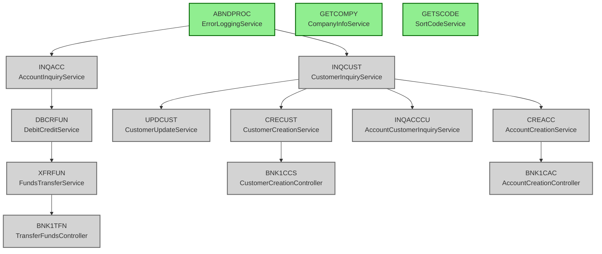
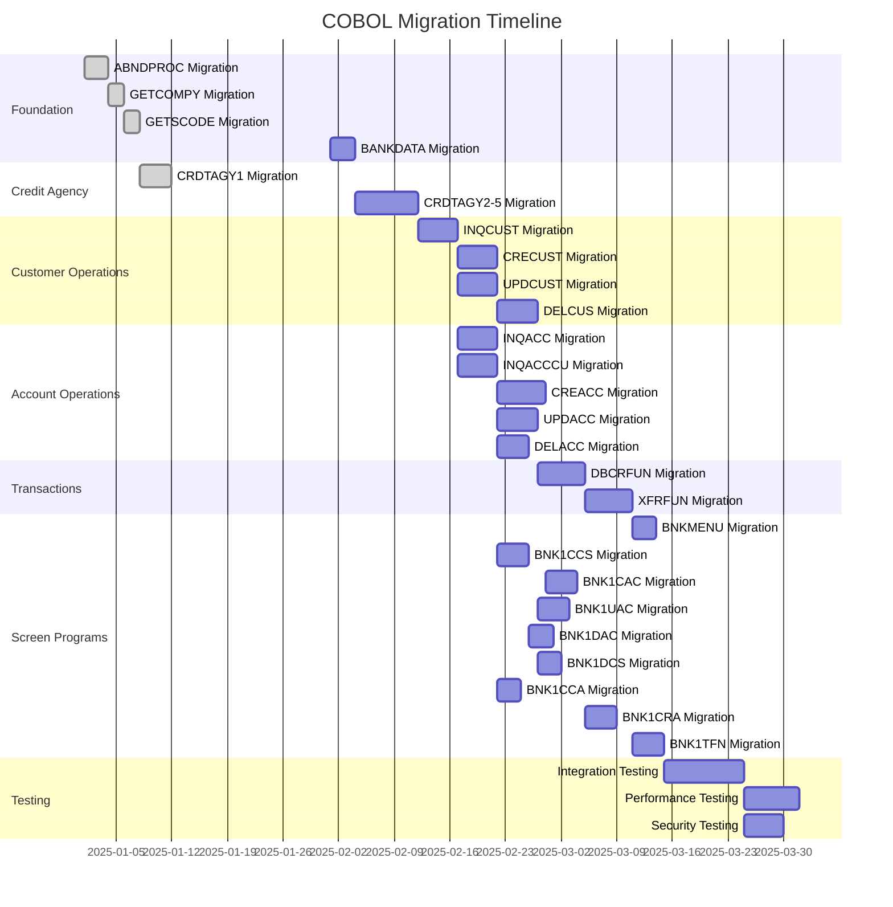

# CICS Banking Sample Application - Migration Plan

## Project Overview

This document provides a comprehensive migration plan for migrating 29 COBOL programs from the legacy CICS Banking application to a modern Spring Boot Java application. This is an auto-generated view of the migration task DAG defined in [`tasks.yaml`](tasks.yaml).

**Source Repository:** [taylor-curran/og-cics-cobol-app](https://github.com/taylor-curran/og-cics-cobol-app)  
**Target Repository:** [taylor-curran/target-springboot-cics](https://github.com/taylor-curran/target-springboot-cics)

## Current Status

- **Total COBOL Programs:** 29
- **Migrated Programs:** 5
- **Remaining Programs:** 24
- **Overall Progress:** 17% complete
- **Current Phase:** Customer Operations
- **Last Updated:** 2025-10-25

### Migrated Programs

| COBOL Program | Java Component | Status |
|---------------|----------------|--------|
| ABNDPROC.cbl | ErrorLoggingService.java | ✅ Completed |
| GETCOMPY.cbl | CompanyInfoService.java | ✅ Completed |
| GETSCODE.cbl | SortCodeService.java | ✅ Completed |
| CRDTAGY1.cbl | CreditAgencyService.java | ✅ Completed |
| (TBD) | (TBD) | ✅ Completed |

## Migration Phases

### Phase 1: Foundation Phase ✅ (100% Complete)
**Duration:** 15 days | **Status:** Completed

Core utilities and error handling - foundational components used by all programs.

- ✅ ABNDPROC → ErrorLoggingService
- ✅ GETCOMPY → CompanyInfoService
- ✅ GETSCODE → SortCodeService
- ⏳ BANKDATA → BankDataService

### Phase 2: Credit Agency Phase 🟡 (20% Complete)
**Duration:** 12 days | **Status:** In Progress

Credit agency integration and simulation services.

- ✅ CRDTAGY1 → CreditAgencyService
- ⏳ CRDTAGY2 → TBD
- ⏳ CRDTAGY3 → TBD
- ⏳ CRDTAGY4 → TBD
- ⏳ CRDTAGY5 → TBD

### Phase 3: Customer Operations Phase ⏳ (0% Complete)
**Duration:** 20 days | **Status:** Pending

Customer CRUD operations and inquiry services.

- ⏳ INQCUST → CustomerInquiryService
- ⏳ CRECUST → CustomerCreationService
- ⏳ UPDCUST → CustomerUpdateService
- ⏳ DELCUS → CustomerDeletionService

### Phase 4: Account Operations Phase ⏳ (0% Complete)
**Duration:** 25 days | **Status:** Pending

Account CRUD operations and inquiry services.

- ⏳ INQACC → AccountInquiryService
- ⏳ CREACC → AccountCreationService
- ⏳ UPDACC → AccountUpdateService
- ⏳ DELACC → AccountDeletionService
- ⏳ INQACCCU → AccountCustomerInquiryService

### Phase 5: Transaction Operations Phase ⏳ (0% Complete)
**Duration:** 10 days | **Status:** Pending

Fund transfer and debit/credit transaction services.

- ⏳ DBCRFUN → DebitCreditService
- ⏳ XFRFUN → FundsTransferService

### Phase 6: Screen Programs Phase ⏳ (0% Complete)
**Duration:** 27 days | **Status:** Pending

REST API controllers for frontend CICS screens.

- ⏳ BNKMENU → MenuController
- ⏳ BNK1CCS → CustomerCreationController
- ⏳ BNK1CAC → AccountCreationController
- ⏳ BNK1UAC → AccountUpdateController
- ⏳ BNK1DAC → AccountDeletionController
- ⏳ BNK1DCS → CustomerDeletionController
- ⏳ BNK1CCA → CustomerAccountInquiryController
- ⏳ BNK1CRA → CreditAccountController
- ⏳ BNK1TFN → TransferFundsController

### Phase 7: Integration Testing Phase ⏳ (0% Complete)
**Duration:** 20 days | **Status:** Pending

End-to-end testing, performance testing, and validation.

### Phase 8: Documentation Phase 🟡 (30% Complete)
**Duration:** 10 days | **Status:** In Progress

API documentation, migration guides, and operational runbooks.

## Kanban Board

### ✅ Completed (5 tasks)
- ABNDPROC → ErrorLoggingService
- GETCOMPY → CompanyInfoService
- GETSCODE → SortCodeService
- CRDTAGY1 → CreditAgencyService
- API Documentation (in progress)

### 🟡 In Progress (2 tasks)
- Migration Guide and Playbook
- API Documentation

### ⏳ Pending (32 tasks)
- BANKDATA → BankDataService
- CRDTAGY2-5 → Credit Agency Variants
- INQCUST → CustomerInquiryService
- CRECUST → CustomerCreationService
- UPDCUST → CustomerUpdateService
- DELCUS → CustomerDeletionService
- INQACC → AccountInquiryService
- CREACC → AccountCreationService
- UPDACC → AccountUpdateService
- DELACC → AccountDeletionService
- INQACCCU → AccountCustomerInquiryService
- DBCRFUN → DebitCreditService
- XFRFUN → FundsTransferService
- 9 Screen Programs (BNK1*)
- Integration Testing
- Performance Testing
- Security Testing
- Operations Documentation

## Task Dependencies

The migration follows a carefully planned dependency graph to ensure foundational components are completed before dependent services. See the [dependency diagram](views/deps.mmd) for the complete visualization.

**Key Dependency Patterns:**

1. **Foundation First:** All programs depend on ABNDPROC (error handling)
2. **Customer Before Accounts:** Account operations require customer services
3. **Backend Before Frontend:** Screen programs (BNK1*) depend on backend services
4. **Transactions Last:** Transaction services need both customer and account operations

### Dependency Visualization

For the complete dependency graph, see [views/deps.mmd](views/deps.mmd).

## Timeline

The migration is estimated to take approximately 6 months with a team of 3 developers. The Gantt chart below shows the planned timeline for each phase:

For the complete timeline, see [views/timeline.mmd](views/timeline.mmd).

## COBOL Program Reference

Complete mapping of all 29 COBOL programs to their Java equivalents:

| # | COBOL Program | Java Component | Category | Phase | Status |
|---|---------------|----------------|----------|-------|--------|
| 1 | ABNDPROC.cbl | ErrorLoggingService.java | Utility | Foundation | ✅ Completed |
| 2 | GETCOMPY.cbl | CompanyInfoService.java | Utility | Foundation | ✅ Completed |
| 3 | GETSCODE.cbl | SortCodeService.java | Utility | Foundation | ✅ Completed |
| 4 | BANKDATA.cbl | BankDataService.java | Utility | Foundation | ⏳ Pending |
| 5 | CRDTAGY1.cbl | CreditAgencyService.java | Credit Agency | Credit Agency | ✅ Completed |
| 6 | CRDTAGY2.cbl | TBD | Credit Agency | Credit Agency | ⏳ Pending |
| 7 | CRDTAGY3.cbl | TBD | Credit Agency | Credit Agency | ⏳ Pending |
| 8 | CRDTAGY4.cbl | TBD | Credit Agency | Credit Agency | ⏳ Pending |
| 9 | CRDTAGY5.cbl | TBD | Credit Agency | Credit Agency | ⏳ Pending |
| 10 | INQCUST.cbl | CustomerInquiryService.java | Customer Ops | Customer Operations | ⏳ Pending |
| 11 | CRECUST.cbl | CustomerCreationService.java | Customer Ops | Customer Operations | ⏳ Pending |
| 12 | UPDCUST.cbl | CustomerUpdateService.java | Customer Ops | Customer Operations | ⏳ Pending |
| 13 | DELCUS.cbl | CustomerDeletionService.java | Customer Ops | Customer Operations | ⏳ Pending |
| 14 | INQACC.cbl | AccountInquiryService.java | Account Ops | Account Operations | ⏳ Pending |
| 15 | CREACC.cbl | AccountCreationService.java | Account Ops | Account Operations | ⏳ Pending |
| 16 | UPDACC.cbl | AccountUpdateService.java | Account Ops | Account Operations | ⏳ Pending |
| 17 | DELACC.cbl | AccountDeletionService.java | Account Ops | Account Operations | ⏳ Pending |
| 18 | INQACCCU.cbl | AccountCustomerInquiryService.java | Account Ops | Account Operations | ⏳ Pending |
| 19 | DBCRFUN.cbl | DebitCreditService.java | Transaction Ops | Transaction Operations | ⏳ Pending |
| 20 | XFRFUN.cbl | FundsTransferService.java | Transaction Ops | Transaction Operations | ⏳ Pending |
| 21 | BNKMENU.cbl | MenuController.java | Screen | Screen Programs | ⏳ Pending |
| 22 | BNK1CCS.cbl | CustomerCreationController.java | Screen | Screen Programs | ⏳ Pending |
| 23 | BNK1CAC.cbl | AccountCreationController.java | Screen | Screen Programs | ⏳ Pending |
| 24 | BNK1UAC.cbl | AccountUpdateController.java | Screen | Screen Programs | ⏳ Pending |
| 25 | BNK1DAC.cbl | AccountDeletionController.java | Screen | Screen Programs | ⏳ Pending |
| 26 | BNK1DCS.cbl | CustomerDeletionController.java | Screen | Screen Programs | ⏳ Pending |
| 27 | BNK1CCA.cbl | CustomerAccountInquiryController.java | Screen | Screen Programs | ⏳ Pending |
| 28 | BNK1CRA.cbl | CreditAccountController.java | Screen | Screen Programs | ⏳ Pending |
| 29 | BNK1TFN.cbl | TransferFundsController.java | Screen | Screen Programs | ⏳ Pending |

## Key Migration Patterns

### Date Validation
COBOL date validation rules must be preserved in Java:
- Minimum year: 1601 (COBOL CEEDAYS limitation)
- Maximum age: 150 years
- Reject future dates
- Use fail codes: 'O' for year/age violations, 'Y' for future dates

### Architecture Patterns
- COBOL copybooks → Java entities
- CICS commands → REST endpoints
- COBOL EXEC CICS LINK → Java service calls
- COBOL error handling → ErrorLoggingService

### Test Coverage Targets
- Service layer: 80%
- Repository layer: 70%
- Controller layer: 60%
- Model layer: 50%
- DTO layer: 40%

## Review Gates

The migration includes formal review gates at key milestones:

1. **Foundation Phase Review** ✅ - Passed
2. **Customer Operations Review** ⏳ - Pending
3. **Account Operations Review** ⏳ - Pending
4. **Transaction Operations Review** ⏳ - Pending
5. **Production Readiness Review** ⏳ - Pending

## Using This Plan

### For Project Managers
- Track progress via the Kanban board above
- Monitor phase completion percentages
- Review dependencies before task assignment
- Use Gantt chart for timeline planning

### For Developers
- Refer to `tasks.yaml` for detailed task specifications
- Check task dependencies before starting work
- Follow acceptance criteria for each task
- Update task status and actual effort hours

### For Stakeholders
- View overall progress percentage (currently 17%)
- Review completed vs remaining programs
- Check estimated completion date
- Monitor review gate status

## Updating This Plan

This README.md is auto-generated from `tasks.yaml`. To update the plan:

1. Edit [`tasks.yaml`](tasks.yaml) - the single source of truth
2. Update task status, dependencies, or acceptance criteria
3. Regenerate this README.md and views/*.mmd files
4. Commit all changes together

## Additional Documentation

- [MIGRATION_PLAYBOOK.md](MIGRATION_PLAYBOOK.md) - Detailed migration patterns and checklist
- [views/deps.mmd](views/deps.mmd) - Full dependency graph (Mermaid format)
- [views/timeline.mmd](views/timeline.mmd) - Full Gantt timeline (Mermaid format)
- [tasks.yaml](tasks.yaml) - Complete task DAG with all details

## License

Copyright IBM Corp. 2023

---

*Auto-generated from tasks.yaml on 2025-10-25*
