# COBOL to Spring Boot Migration Plan

> **Migration Status:** 17% Complete (5/29 programs)  
> **Last Updated:** 2025-10-25

This repository contains the Spring Boot migration of the CICS Bank Sample Application (CBSA) from COBOL. This README provides a comprehensive overview of the migration plan, current status, and visualizations of the task dependencies and timeline.

## 📋 Table of Contents

- [Overview](#overview)
- [Current Status](#current-status)
- [Migration Plan](#migration-plan)
- [Task Dependencies](#task-dependencies)
- [Timeline](#timeline)
- [Kanban Board](#kanban-board)
- [Key Decisions](#key-decisions)
- [Risks & Mitigations](#risks--mitigations)
- [Getting Started](#getting-started)
- [Documentation](#documentation)

## 🎯 Overview

**Source:** [taylor-curran/og-cics-cobol-app](https://github.com/taylor-curran/og-cics-cobol-app) (29 COBOL programs, 25,566 lines)  
**Target:** [taylor-curran/target-springboot-cics](https://github.com/taylor-curran/target-springboot-cics) (Spring Boot 2.7.18, SQLite, Maven)

### Architecture

- **COBOL Stack:** CICS TS 6.1+, DB2 v12+, VSAM files, BMS maps
- **Java Stack:** Spring Boot 2.7.18, SQLite (JDBC), JUnit 5, Mockito
- **Migration Approach:** Program-by-program migration with REST API replacement for BMS UI

### Coverage Targets

- Service Layer: ≥80%
- Repository Layer: ≥70%
- Controller Layer: ≥60%
- Model Layer: ≥50%
- DTO Layer: ≥40%

## 📊 Current Status

### Completed Programs (2/29)

| COBOL Program | Lines | Java Service | Status |
|---------------|-------|--------------|--------|
| GETCOMPY | 43 | CompanyInfoService | ✅ Done |
| GETSCODE | 46 | SortCodeService | ✅ Done |

### In Progress (2/29)

| COBOL Program | Lines | Java Service | Status | Progress |
|---------------|-------|--------------|--------|----------|
| ABNDPROC | 176 | ErrorLoggingService | 🟡 In Progress | ~60% |
| CRDTAGY1-5 | 5×275 | CreditAgencyService | 🟡 In Progress | ~70% |

### Remaining Programs (25/29)

**Phase 2 - Core Services (3):** INQCUST, INQACC, INQACCCU  
**Phase 3 - Customer Operations (3):** CRECUST, UPDCUST, DELCUS  
**Phase 4 - Account Operations (3):** CREACC, UPDACC, DELACC  
**Phase 5 - Transaction Services (2):** DBCRFUN, XFRFUN  
**Phase 6 - BMS UI Programs (9):** BNKMENU, BNK1CCA, BNK1CAC, BNK1UAC, BNK1CRA, BNK1DAC, BNK1CCS, BNK1DCS, BNK1TFN  
**Phase 7 - Data Initialization (1):** BANKDATA  
**Phase 8 - Testing & Deployment (4):** Integration tests, performance, security, rollback

### Overall Progress

```
Foundation:        ████████░░ 80% (4/5 tasks)
Core Services:     ░░░░░░░░░░  0% (0/4 tasks)
Customer Ops:      ░░░░░░░░░░  0% (0/4 tasks)
Account Ops:       ░░░░░░░░░░  0% (0/4 tasks)
Transactions:      ░░░░░░░░░░  0% (0/3 tasks)
BMS UI:            ░░░░░░░░░░  0% (0/9 tasks)
Data Init:         ░░░░░░░░░░  0% (0/1 task)
Testing/Deploy:    ░░░░░░░░░░  0% (0/4 tasks)
──────────────────────────────────────
Overall:           █████░░░░░ 17% (5/29 programs)
```

## 🗺️ Migration Plan

The complete migration plan is defined in [`tasks.yaml`](./tasks.yaml) following a DAG (Directed Acyclic Graph) structure with explicit dependencies and checkpoints.

### Phase Structure

1. **Foundation (Phase 1)** - Utilities, error handling, credit agencies
2. **Core Services (Phase 2)** - Query operations (INQCUST, INQACC, INQACCCU)
3. **Customer Operations (Phase 3)** - Create, update, delete customers
4. **Account Operations (Phase 4)** - Create, update, delete accounts
5. **Transaction Services (Phase 5)** - Debit, credit, transfer
6. **BMS UI Programs (Phase 6)** - REST API wrappers for UI operations
7. **Data Initialization (Phase 7)** - Test data generation
8. **Testing & Deployment (Phase 8)** - Integration, performance, security, cutover

### Checkpoints (Review Gates)

8 mandatory checkpoints with sign-off requirements:

1. ✅ **Architecture Review** - Schema, service layer design
2. 🟡 **Foundation Complete** - Utilities and error handling (ready for review)
3. ⏳ **Core Services Complete** - Query operations validated
4. ⏳ **Customer Operations Complete** - CRUD operations tested
5. ⏳ **Account Operations Complete** - Account management verified
6. ⏳ **Transaction Services Complete** - Transaction integrity confirmed
7. ⏳ **Integration Tests Complete** - E2E testing passed
8. ⏳ **Cutover Readiness** - GO/NO-GO decision

## 🔗 Task Dependencies

The following Mermaid diagram shows the dependency relationships between tasks. Each node represents a migration task, and arrows indicate dependencies (A → B means B depends on A).

```mermaid
graph TD
    %% Foundation Phase
    foundation-getcompy[GETCOMPY ✅]
    foundation-getscode[GETSCODE ✅]
    foundation-abndproc[ABNDPROC 🟡]
    foundation-crdtagy[CRDTAGY1-5 🟡]
    checkpoint-foundation[🚦 Foundation Complete]
    
    foundation-abndproc --> checkpoint-foundation
    foundation-crdtagy --> checkpoint-foundation
    
    %% Core Services Phase
    core-inqcust[INQCUST]
    core-inqacc[INQACC]
    core-inqacccu[INQACCCU]
    checkpoint-core[🚦 Core Services Complete]
    
    checkpoint-foundation --> core-inqcust
    checkpoint-foundation --> core-inqacc
    core-inqcust --> core-inqacccu
    core-inqacc --> core-inqacccu
    core-inqcust --> checkpoint-core
    core-inqacc --> checkpoint-core
    core-inqacccu --> checkpoint-core
    
    %% Customer Operations Phase
    customer-crecust[CRECUST]
    customer-updcust[UPDCUST]
    customer-delcus[DELCUS]
    checkpoint-customer[🚦 Customer Ops Complete]
    
    checkpoint-core --> customer-crecust
    foundation-crdtagy --> customer-crecust
    core-inqcust --> customer-updcust
    customer-crecust --> customer-updcust
    customer-crecust --> checkpoint-customer
    customer-updcust --> checkpoint-customer
    customer-delcus --> checkpoint-customer
    
    %% Account Operations Phase
    account-creacc[CREACC]
    account-updacc[UPDACC]
    account-delacc[DELACC]
    checkpoint-account[🚦 Account Ops Complete]
    
    checkpoint-core --> account-creacc
    core-inqcust --> account-creacc
    core-inqacccu --> account-creacc
    core-inqacc --> account-updacc
    core-inqacc --> account-delacc
    core-inqcust --> customer-delcus
    core-inqacccu --> customer-delcus
    account-delacc --> customer-delcus
    account-creacc --> checkpoint-account
    account-updacc --> checkpoint-account
    account-delacc --> checkpoint-account
    
    %% Transaction Services Phase
    transaction-dbcrfun[DBCRFUN]
    transaction-xfrfun[XFRFUN]
    checkpoint-transaction[🚦 Transaction Services Complete]
    
    checkpoint-account --> transaction-dbcrfun
    transaction-dbcrfun --> transaction-xfrfun
    transaction-dbcrfun --> checkpoint-transaction
    transaction-xfrfun --> checkpoint-transaction
    
    %% BMS UI Phase
    ui-bnkmenu[BNKMENU]
    ui-bnk1cca[BNK1CCA]
    ui-bnk1cac[BNK1CAC]
    ui-bnk1uac[BNK1UAC]
    ui-bnk1cra[BNK1CRA]
    ui-bnk1dac[BNK1DAC]
    ui-bnk1ccs[BNK1CCS]
    ui-bnk1dcs[BNK1DCS]
    ui-bnk1tfn[BNK1TFN]
    
    checkpoint-transaction --> ui-bnkmenu
    core-inqacccu --> ui-bnk1cca
    account-creacc --> ui-bnk1cac
    account-updacc --> ui-bnk1uac
    customer-crecust --> ui-bnk1cra
    account-delacc --> ui-bnk1dac
    core-inqcust --> ui-bnk1ccs
    customer-delcus --> ui-bnk1dcs
    transaction-xfrfun --> ui-bnk1tfn
    
    %% Data Initialization Phase
    data-bankdata[BANKDATA]
    
    checkpoint-account --> data-bankdata
    checkpoint-customer --> data-bankdata
    
    %% Testing & Deployment Phase
    checkpoint-integration[🚦 Integration Tests Complete]
    test-performance[Performance Baseline]
    test-security[Security Scan]
    deploy-rollback[Rollback Plan]
    checkpoint-cutover[🚦 Cutover Readiness]
    
    ui-bnkmenu --> checkpoint-integration
    ui-bnk1cca --> checkpoint-integration
    ui-bnk1cac --> checkpoint-integration
    ui-bnk1uac --> checkpoint-integration
    ui-bnk1cra --> checkpoint-integration
    ui-bnk1dac --> checkpoint-integration
    ui-bnk1ccs --> checkpoint-integration
    ui-bnk1dcs --> checkpoint-integration
    ui-bnk1tfn --> checkpoint-integration
    data-bankdata --> checkpoint-integration
    
    checkpoint-integration --> test-performance
    checkpoint-integration --> test-security
    test-performance --> deploy-rollback
    test-security --> deploy-rollback
    deploy-rollback --> checkpoint-cutover
    
    %% Styling
    classDef done fill:#90EE90,stroke:#2E8B57,stroke-width:2px
    classDef inProgress fill:#FFD700,stroke:#DAA520,stroke-width:2px
    classDef checkpoint fill:#87CEEB,stroke:#4682B4,stroke-width:3px
    
    class foundation-getcompy,foundation-getscode done
    class foundation-abndproc,foundation-crdtagy inProgress
    class checkpoint-foundation,checkpoint-core,checkpoint-customer,checkpoint-account,checkpoint-transaction,checkpoint-integration,checkpoint-cutover checkpoint
```



For a detailed, renderable version, see [`views/deps.mmd`](./views/deps.mmd).

## 📅 Timeline

The following Gantt chart shows the estimated timeline for the migration phases.


For a detailed, renderable version, see [`views/timeline.mmd`](./views/timeline.mmd).

## 📋 Kanban Board

### ✅ Done (2 tasks)

- **foundation-getcompy** - GETCOMPY (43 lines) → CompanyInfoService
- **foundation-getscode** - GETSCODE (46 lines) → SortCodeService

### 🟡 In Progress (2 tasks)

- **foundation-abndproc** - ABNDPROC (176 lines) → ErrorLoggingService
- **foundation-crdtagy-unified** - CRDTAGY1-5 (5×275 lines) → CreditAgencyService

### 🟢 Ready (4 tasks)

- **checkpoint-foundation-complete** - CHECKPOINT: Foundation Complete
- **core-inqcust** - INQCUST (711 lines) → CustomerInquiryService
- **core-inqacc** - INQACC (1002 lines) → AccountInquiryService
- **core-inqacccu** - INQACCCU (882 lines) → CustomerAccountsService

### 📦 Backlog (29 tasks)

**Core Services:**
- checkpoint-core-services-complete

**Customer Operations:**
- customer-crecust - CRECUST (1439 lines) → CustomerCreationService
- customer-updcust - UPDCUST (364 lines) → CustomerUpdateService
- customer-delcus - DELCUS (761 lines) → CustomerDeletionService
- checkpoint-customer-operations-complete

**Account Operations:**
- account-creacc - CREACC (1247 lines) → AccountCreationService
- account-updacc - UPDACC (406 lines) → AccountUpdateService
- account-delacc - DELACC (649 lines) → AccountDeletionService
- checkpoint-account-operations-complete

**Transaction Services:**
- transaction-dbcrfun - DBCRFUN (861 lines) → DebitCreditService
- transaction-xfrfun - XFRFUN (1924 lines) → TransferService
- checkpoint-transaction-services-complete

**BMS UI Programs:**
- ui-bnkmenu - BNKMENU (1311 lines) → MenuService
- ui-bnk1cca - BNK1CCA (952 lines) → CustomerAccountListService
- ui-bnk1cac - BNK1CAC (1298 lines) → AccountCreationUIService
- ui-bnk1uac - BNK1UAC (1405 lines) → AccountUpdateUIService
- ui-bnk1cra - BNK1CRA (1166 lines) → CustomerCreationUIService
- ui-bnk1dac - BNK1DAC (1158 lines) → AccountDeletionUIService
- ui-bnk1ccs - BNK1CCS (1657 lines) → CustomerSearchUIService
- ui-bnk1dcs - BNK1DCS (2053 lines) → CustomerDeletionUIService
- ui-bnk1tfn - BNK1TFN (1224 lines) → TransferUIService

**Data Initialization:**
- data-bankdata - BANKDATA (1463 lines) → DataInitializationService

**Testing & Deployment:**
- checkpoint-integration-tests-complete
- test-performance-baseline - Performance Baseline Testing
- test-security-scan - Security Scan & Vulnerability Assessment
- deploy-rollback-plan - Create Rollback Plan & Documentation
- checkpoint-cutover-readiness - CHECKPOINT: Cutover Readiness Review

## 🎯 Key Decisions

### Assumptions

1. **BMS UI Migration:** BMS programs (BNK1*) will be replaced with REST APIs, not migrated directly as UI
2. **Credit Agency Consolidation:** CRDTAGY1-5 unified into single CreditAgencyService (already in progress)
3. **Batch Data Migration:** BANKDATA converted to Spring Boot @PostConstruct or separate migration script
4. **Dual Schema Approach:** H2 for tests, SQLite for production (requires careful synchronization)
5. **Coverage Strategy:** Service 80%, Repository 70%, Controller 60%, Model 50%, DTO 40%
6. **Error Handling:** All programs use ABNDPROC → centralized ErrorLoggingService needed
7. **Date Validation Preservation:** COBOL rules must be preserved (min year 1601, max age 150, reject future dates)

### Key Dependencies Mapped

- **CREACC** depends on **INQCUST**, **INQACCCU** (validate customer exists, check accounts)
- **INQACCCU** depends on **INQCUST** (customer must exist to query accounts)
- **DELCUS** depends on **INQCUST**, **INQACCCU**, **DELACC** (cascade deletion)
- **BNK1CCA** depends on **INQACCCU** (list customer accounts UI)
- All programs depend on **ABNDPROC** → **ErrorLoggingService** for error handling

## ⚠️ Risks & Mitigations

| ID | Risk | Mitigation |
|----|------|-----------|
| risk-001 | Schema synchronization between H2 and SQLite | Use DatabaseSchemaConsistencyTest, update both schemas together, automate sync checks |
| risk-002 | Complex dependencies between programs | Follow strict dependency order: INQCUST → INQACCCU → CREACC. Test each layer before proceeding. |
| risk-003 | BMS map complexity in UI programs (9 programs, ~1200 lines each) | Focus on REST API backend first, defer full UI to separate effort. Document mapping. |
| risk-004 | Transaction isolation in XFRFUN (1924 lines, complex rollback logic) | Use Spring @Transactional, test rollback scenarios thoroughly, preserve COBOL deadlock retry logic |
| risk-005 | VSAM to SQLite data migration | BANKDATA provides migration logic. Create parallel migration script with validation. |
| risk-006 | Async credit agency calls (CRDTAGY* with delays) | Use Spring @Async, preserve delay simulation, test with CompletableFuture |
| risk-007 | 16 existing feature branches from previous attempts | Review and consolidate learnings, ensure new plan addresses previous blockers |
| risk-008 | Named counter generation (ENQUEUE/DEQUEUE for IDs) | Use database sequences or synchronized ID generation service |

## 🚀 Getting Started

### Prerequisites

- Java 17+
- Maven 3.8+
- SQLite 3.x

### Build & Test

```bash
# Clone the repository
git clone https://github.com/taylor-curran/target-springboot-cics.git
cd target-springboot-cics

# Build the project
mvn clean install

# Run tests
mvn test

# Run integration tests
mvn verify

# Generate coverage report
mvn jacoco:report
# View report: target/site/jacoco/index.html
```

### Run the Application

```bash
# Run with default profile (SQLite)
mvn spring-boot:run

# Run with test data initialization
mvn spring-boot:run -Dspring-boot.run.arguments="--bank.init-data-on-startup=true"

# Access the application
curl http://localhost:8080/api/utility/company-name
curl http://localhost:8080/api/utility/sortcode
```

## 📚 Documentation

### Core Documentation

- **[tasks.yaml](./tasks.yaml)** - Complete migration plan DAG (single source of truth)
- **[MIGRATION_PLAYBOOK.md](./MIGRATION_PLAYBOOK.md)** - Migration methodology and best practices
- **[views/deps.mmd](./views/deps.mmd)** - Mermaid dependency graph (renderable)
- **[views/timeline.mmd](./views/timeline.mmd)** - Mermaid Gantt timeline (renderable)

### Source Repository Documentation

- [og-cics-cobol-app README](https://github.com/taylor-curran/og-cics-cobol-app/blob/main/README.md) - Original COBOL application overview
- [CBSA Architecture Guide](https://github.com/taylor-curran/og-cics-cobol-app/blob/main/doc/CBSA_Architecture_guide.md) - Detailed architecture documentation

### Migration Standards

All migrations follow these standards from [MIGRATION_PLAYBOOK.md](./MIGRATION_PLAYBOOK.md):

1. **Find & Understand** - Analyze COBOL program thoroughly
2. **Create Service** - Implement Java service with business logic
3. **Write Tests First** - TDD approach with coverage targets
4. **Add Repository** - Implement data access layer
5. **Create Controller** - Add REST API endpoints
6. **Check Coverage** - Verify targets met before proceeding

### COBOL Date Validation Rules

Preserve these rules in Java implementations (see [Cobol Tips note]()):

- **Minimum year:** 1601 (COBOL CEEDAYS limitation)
- **Maximum age:** 150 years
- **Reject future dates**
- **Fail codes:** 'O' for year/age violations, 'Y' for future dates

Implementation in Java:

```java
public void validateDateOfBirth(LocalDate dob) {
    if (dob.getYear() < 1601) {
        throw new ValidationException("Date of birth year must be >= 1601", "O");
    }
    
    long age = ChronoUnit.YEARS.between(dob, LocalDate.now());
    if (age > 150) {
        throw new ValidationException("Age cannot exceed 150 years", "O");
    }
    
    if (dob.isAfter(LocalDate.now())) {
        throw new ValidationException("Date of birth cannot be in the future", "Y");
    }
}
```

## 🔄 Updating This Plan

The migration plan is a living document. To update:

1. **Edit [`tasks.yaml`](./tasks.yaml)** - This is the single source of truth
2. **Update task states** - Change from `backlog` → `ready` → `in_progress` → `review` → `done`
3. **Update context.status** - Reflect current progress percentage and notes
4. **Regenerate views** - Update [`views/deps.mmd`](./views/deps.mmd) and [`views/timeline.mmd`](./views/timeline.mmd) to match
5. **Regenerate README** - Update this file to reflect new status and Kanban board
6. **Commit changes** - Keep all files in sync

## 📞 Contact & Support

- **Repository:** [taylor-curran/target-springboot-cics](https://github.com/taylor-curran/target-springboot-cics)
- **Source Repo:** [taylor-curran/og-cics-cobol-app](https://github.com/taylor-curran/og-cics-cobol-app)
- **Maintainer:** @taylor-curran

## 📜 License

[Same as source CBSA repository]

---

**Note:** This migration plan was generated by Devin AI. For the complete session details, see: [Devin Run d08330912514406f8fb9b4a531f94f87](https://app.devin.ai/sessions/d08330912514406f8fb9b4a531f94f87)
